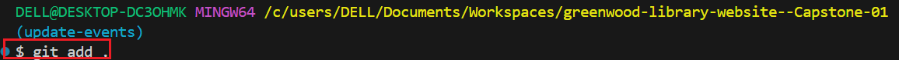

greenwood-library-website

# Greenwood Library Project - Capstone 01

In this project, I am part of a deveolopement team tasked with enhancing the website for _*Greenwood Community Library*_ 

### TASK:

Create a new directory named *greenwood-library-project* in my repository.

Clone into the directory using the command _code . + Enter_ to open the directory in vscode

I then go into  Darey-Projects folder using the _ls_ command

Then I change I change directory to _*greenwood-library-project--Capstone-01*_ using the _cd_ command

### TASK:

Create files each for 

* home.html
* about_us.html
* events.html
* contact_us.html

Use _touch_ command

I used _ls_ command to view the created files

## Created files

### TASK:

* Stage
* Commit
* Push
 changes 

 directly to the main branch branch

 ### STEPS:

 ## 1. Activate git using _git status_ command

 

 ### 2. Use _git add ._ to add all files to repository, then view with _git status_ command

 

 ### 3. Commit changes to repository using "_git commit -m_" command

 

There were changes made so making the readme file to be highlighted

So I had to add all files using "_*git add*_" and then I commited the changes using "_"git commit -m"_" command

After which I pushed the whole changes to the repository

# TASK NUMBER 2
## Morgan's work: Adding book reviews

1. Create and switche to a new branch named "_add-book-reviews_" using the command *_git checkout -b add-book-reviews_*

A new file *_book-reviews_* was added to thr new branch (add-book-reviews) using the _touch_ command 

I staged with the command *-git add book-reviews-* 

Then committed the changes

I then push changes to git gub 

Then, PR for Morgan's work was raised and created

Then merged

And confirmed

Working tree clean

# TASK NUMBER 3

## Jamie's Work: Updating Events age

### 1. 
Am required to pull the latest changes from the main branch into update-events by using the _git pull_ command

### 2.
I created and switched a new branch for Jamie called "_update-events_"

### 3.

I staged ...

Then committed changes made

And then pushed to my repository

